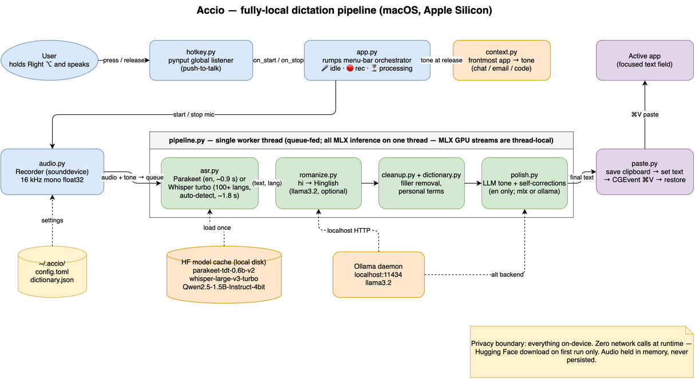

<div align="center">

# 🪄 Accio

**Hold a key, talk, and clean text appears — without your voice ever leaving your machine.**

A private, fully-local voice dictation app. Push-to-talk dictation with
on-device speech recognition and LLM cleanup — an independent, offline take on the
[Wispr Flow](https://wisprflow.ai) experience. Runs on Apple Silicon macOS
(MLX) and Windows (faster-whisper + Ollama).

[](https://www.apple.com/macos/)
[](https://www.microsoft.com/windows)
[](https://support.apple.com/en-us/116943)
[](https://www.python.org/)
[](tests/)
[](LICENSE)

[](https://github.com/ml-explore/mlx)
[](#privacy)
[](#multilingual-dictation)

<br>

*"Your voice is yours. Accio keeps it that way."*

**push-to-talk · on-device speech + LLM cleanup · English + Hinglish · nothing leaves your machine · free & open source**

<br>

[Why](#why-accio) · [How It Works](#how-it-works) · [Features](#features) · [Quick Start](#quick-start) · [Privacy](#privacy)

</div>

<!-- TODO before launch: record a ~20s demo GIF and drop it here.
     Money shot: dictate, then toggle Wi-Fi OFF and dictate again — still works. -->

---

```
        RECORD                    UNDERSTAND                    INSERT
   ┌────────────────┐        ┌────────────────┐        ┌────────────────┐
   │  Hold a key,   │        │  Whisper /     │        │  Clean text     │
   │  speak into    │───────▶│  Parakeet ASR  │───────▶│  pasted at your │
   │  any text field│        │  + LLM cleanup │        │  cursor (⌘V)    │
   │  (push-to-talk)│        │  → on-device   │        │  clipboard-safe │
   └────────────────┘        └────────────────┘        └────────────────┘
      release to stop          fillers removed,            restores your
     16 kHz mono audio        self-corrections fixed      clipboard after

                          nothing leaves your machine
```

---

## Why Accio

You've probably seen the Wispr Flow ad — it's everywhere. It's a lovely dictation
app: hold a key, talk, clean text appears in any app. But every word you speak is
uploaded to their cloud, there's a 2,000-words-a-week free cap before $15/month,
and you need an account.

**Accio does the same thing, entirely on your machine.** On macOS the speech
model *and* the language model that cleans up your "ums" both run on Apple
Silicon via MLX. On Windows, ASR runs on `faster-whisper` (CPU or CUDA) and the
LLM cleanup runs through a local [Ollama](https://ollama.com) daemon. No cloud,
no account, no API keys — pull your Wi-Fi mid-sentence and it still works. It
even speaks Hinglish, which the cloud apps don't.

Same interaction, opposite privacy model. Free and open source.

---

## How It Works

```
1. RECORD      Hold Right Option → the mic records while you talk (16 kHz
               mono, in memory). Release to stop. A menu-bar icon shows
               idle / recording / processing.

2. UNDERSTAND  A single worker (all MLX inference on one thread) runs:
               Whisper or Parakeet for transcription → rule cleanup (fillers,
               whitespace, your personal dictionary) → a small local LLM that
               fixes punctuation, tone, and self-corrections. Tone adapts to
               the frontmost app (casual in Slack, formal in Mail).

3. INSERT      The final text is pasted at your cursor the way Wispr does it:
               save the clipboard → set the text → synthesize ⌘V → restore
               your clipboard. Works in any text field.
```

Batch-per-utterance (not streaming) — waiting for the full sentence is what lets
the LLM rewrite it. End-to-end ~2s on an M4.

Example, spoken into an email: *"um so basically can you send the report on
tuesday, no wait, wednesday"* → **"Can you send the report by Wednesday?"**

---

## Features

| | Feature | Detail |
|---|---|---|
| 🔒 | **100% on-device** | Speech recognition and LLM cleanup both run locally via Apple MLX. Zero network calls at runtime — unplug your Wi-Fi and it still works. |
| 🎙️ | **Push-to-talk** | Hold Right Option (configurable), speak, release. Text lands wherever your cursor is — Slack, Mail, editors, any field. |
| ✨ | **LLM cleanup** | Removes fillers, fixes punctuation, and applies self-corrections — *"Tuesday, no wait Wednesday"* becomes *"Wednesday."* Tone adapts per app. |
| 🌏 | **English + Hinglish** | Auto-detects language per sentence. Hindi comes out as romanized Hinglish (*"kal meeting teen baje hai"*), never Devanagari, never translated. |
| 📖 | **Personal dictionary** | Teach it names and terms it mishears — a simple `spoken → written` map. |
| 🚀 | **Launch at login** | `accio install` deploys a background agent + a Spotlight-searchable **Accio.app**. Type "Accio" to summon it. |
| 🆓 | **Free & open source** | MIT licensed. Unlimited words, no account, no telemetry. |

### Accio vs Wispr Flow

|                       | Accio        | Wispr Flow                    |
| --------------------- | ------------ | ----------------------------- |
| Where your audio goes | Stays on Mac | Uploaded to their cloud       |
| Price                 | Free         | $15/mo after 2,000 words/week |
| Works offline         | ✅ Yes       | ❌ No (cloud ASR)             |
| Account required      | ❌ No        | ✅ Yes                        |
| Hindi → Hinglish      | ✅ Yes       | Devanagari                    |
| Source available      | ✅ MIT       | ❌ Closed                     |

---

## Quick Start

### macOS (Apple Silicon)

**Requirements:** Apple Silicon Mac, macOS 14+, and [uv](https://docs.astral.sh/uv/).

```bash
git clone https://github.com/anuragmerndev/accio-ai.git
cd accio-ai
uv sync                       # installs the [darwin] extras (mlx-whisper, parakeet-mlx, rumps, …)
uv run accio
```

First run downloads the models from Hugging Face (~1.5 GB) into the standard HF
cache; after that it is fully offline.

### Windows (10 / 11)

**Requirements:** Windows 10 or 11, Python 3.12+, [uv](https://docs.astral.sh/uv/),
and [Ollama](https://ollama.com) running locally for the polish pass.

```powershell
git clone https://github.com/anuragmerndev/accio-ai.git
cd accio-ai
uv sync --extra windows      # installs pystray, faster-whisper, sounddevice, pynput, …
ollama pull llama3.2         # small model used for cleanup + romanization
uv run accio
```

The first run downloads a `faster-whisper` model (~150 MB for the default
`tiny.en`) into the Hugging Face cache; ASR then runs fully offline. The LLM
cleanup calls out to the Ollama daemon on `http://localhost:11434`, which stays
shut inside your machine.

A **system-tray icon** (pystray) appears when `accio` starts — the same
idle/recording/processing indicators as the macOS menu-bar app, with a
right-click menu for Start/Stop/Quit.

### Permissions (one-time)

#### macOS
Grant these to your terminal (or whatever launches `accio`) in **System Settings
→ Privacy & Security**:

- **Microphone** — to record your speech
- **Input Monitoring** — to *receive* the global hotkey (the app requests this on
  launch and registers itself in the list; just toggle it on)
- **Accessibility** — to *send* the ⌘V paste keystroke

Input Monitoring and Accessibility are separate permissions — the first lets the
app hear your hotkey, the second lets it paste. You need both. Restart after
granting.

#### Windows
On first launch Windows will prompt for:

- **Microphone** — to record your speech. Grant via **Settings → Privacy & Security
  → Microphone**.
- **Input Monitoring** is not required on Windows — pynput's global keyboard hook
  works without extra permission on Windows.
- **Paste** uses Win32 `SendInput` for Ctrl+V and the Win32 clipboard API for
  saving/restoring your clipboard. No separate Accessibility permission is needed.

### Launch at login

#### macOS
```bash
uv run accio install     # start at every login + create Spotlight Accio.app
uv run accio uninstall   # stop doing so
uv run accio start        # (re)start now, no logout needed
uv run accio stop         # stop until next login / start
```

Because a repo under `~/Desktop` is shielded from background agents by macOS,
`install` deploys a self-contained copy to `~/Library/Application Support/accio`
and points a LaunchAgent there. Re-run `install` after code changes.

#### Windows
```powershell
uv run accio install     # drop a .bat launcher in shell:startup (launch-at-login)
uv run accio uninstall   # remove the launcher
uv run accio start        # start a background instance now
uv run accio stop         # stop the background instance
```

`install` writes a small `.bat` into your per-user Startup folder
(`shell:startup` → `%APPDATA%\Microsoft\Windows\Start Menu\Programs\Startup\accio.bat`)
that points back at the repo, so no copy of the code is made. Re-run `install`
after code changes to refresh the launcher.

---

## Configuration

Optional files in `~/.accio/`:

`config.toml`
```toml
asr_backend = "parakeet"     # macOS: "parakeet" (fast, English) or "whisper" (multilingual, MLX)
                             # Windows: defaults to "whisper" (faster-whisper backend); "parakeet" unavailable
asr_model = "mlx-community/parakeet-tdt-0.6b-v2"
whisper_model = "mlx-community/whisper-large-v3-turbo"        # macOS (MLX)
                             # Windows default: "Syuaa/whisper-tiny.en"  (faster-whisper CPU)
faster_whisper_device = "auto"            # "auto" | "cpu" | "cuda"  (Windows only)
faster_whisper_compute_type = "int8"      # int8 (CPU), int8_float16 (CUDA)
polish_languages = ["en"]    # LLM polish only runs for these
romanize_languages = []      # e.g. ["hi"] pastes Hindi as romanized Hinglish (via Ollama)
romanize_model = "llama3.2"
llm_model = "mlx-community/Qwen2.5-1.5B-Instruct-4bit"   # macOS (MLX)
llm_polish = true
llm_backend = "mlx"          # "mlx" (in-process, macOS default) or "ollama" (local daemon, Windows default)
hotkey = "alt_r"             # alt_r, alt_l, cmd_r, ctrl_r, f13 (macOS) — on Windows use win_r / win_l
```

### Personal dictionary — teach it your names and terms

`~/.accio/dictionary.json` maps what the model *hears* → what you *want written*,
as whole words, case-insensitively. This fixes proper nouns the ASR mangles —
Whisper hears the uncommon word "Accio" as "Akio" or "Aqio", so map the
mishearings to the right spelling:

```json
{
  "akio": "Accio",
  "aqio": "Accio",
  "anurag": "Anurag",
  "java script": "JavaScript"
}
```

Build your library over time: when a name comes out wrong, add the wrong spelling
on the left and the correct one on the right, then restart.

---

## Multilingual dictation

Set `asr_backend = "whisper"` for 100+ languages (incl. Hindi/Hinglish) with
per-utterance auto-detection — speak whichever language you like, no switching.
Whisper is ~2x slower than Parakeet on short utterances (~1.8 s vs ~0.9 s).

With `romanize_languages = ["hi"]`, Hindi output is converted from Devanagari to
natural romanized Hinglish (*"कल मीटिंग तीन बजे है"* → *"kal meeting teen baje
hai"*) by a local LLM via Ollama — same words, Latin script, never translated.

---

## Privacy

No network calls at runtime. Models download once from Hugging Face on first run,
then everything — audio, transcripts, your dictionary — stays on-device. Audio is
held in memory only and never persisted. There is no account, no server, and no
telemetry. The only optional local dependency is [Ollama](https://ollama.com) on
`localhost` for Hinglish romanization.

---

## Architecture



| Module | Responsibility |
|---|---|
| `audio.py` | mic capture via sounddevice (shared) |
| `asr.py` | Parakeet (English) or Whisper (multilingual) — MLX on macOS, `faster-whisper` on Windows |
| `cleanup.py` | deterministic filler / whitespace rules (shared) |
| `dictionary.py` | personal term replacements (shared) |
| `polish.py` | optional local-LLM rewrite with tone hint (mlx-lm or Ollama) (shared) |
| `hotkey.py` | pynput push-to-talk (shared) |
| `pipeline.py` | single worker thread; all MLX inference on one thread (shared) |
| `platform/darwin/context.py` | frontmost app → tone (NSWorkspace) |
| `platform/darwin/paste.py` | clipboard-swap ⌘V insertion (NSPasteboard + CGEvent) |
| `platform/darwin/tray.py` | rumps menu bar + orchestration + watchdog |
| `platform/darwin/service.py` | LaunchAgent install/uninstall, Spotlight Accio.app |
| `platform/windows/context.py` | frontmost app → tone (GetForegroundWindow) |
| `platform/windows/paste.py` | clipboard-swap Ctrl+V insertion (Win32 clipboard + SendInput) |
| `platform/windows/tray.py` | pystray system-tray app + orchestration + watchdog |
| `platform/windows/service.py` | Startup-folder `.bat` launcher (launch-at-login) |
| `app.py` | dispatcher to `platform.<os>.tray.run_tray()` |

### Development

```bash
uv run pytest                  # 48 passing + 8 darwin-only skipped on Windows
                               # 53 passing on macOS
```

The 8 macOS-only tests (LaunchAgent plist shape, `.app` bundle resources, and
the MLX stream regression that shells out to `say`) are marked with
`pytest.mark.skipif(sys.platform != "darwin", ...)` and are auto-skipped on
Windows so the suite stays green on both platforms.

Design doc:
[docs/superpowers/specs/2026-07-02-local-wispr-clone-design.md](docs/superpowers/specs/2026-07-02-local-wispr-clone-design.md)

---

## Credits

Built on the open-source ecosystem that makes local speech possible:
[parakeet-mlx](https://github.com/senstella/parakeet-mlx) and
[mlx-whisper](https://github.com/ml-explore/mlx-examples) for ASR on macOS,
[faster-whisper](https://github.com/SYSTRAN/faster-whisper) for ASR on Windows,
[mlx-lm](https://github.com/ml-explore/mlx-lm) and [Ollama](https://ollama.com)
for the polish/romanize passes, [rumps](https://github.com/jaredks/rumps) for the
macOS menu bar, and [pystray](https://github.com/moses-palmer/pystray) for the
Windows system tray. Design inspired by [VoiceInk](https://github.com/Beingpax/VoiceInk)
and [Handy](https://github.com/cjpais/handy).

## Disclaimer

Accio is an independent, from-scratch reimplementation for personal use. It is
**not affiliated with, endorsed by, or derived from Wispr Flow or Wispr AI** —
"Wispr Flow" is referenced only to describe the interaction model this project
reproduces locally.

## License

[MIT](LICENSE) © 2026 anuragmerndev
